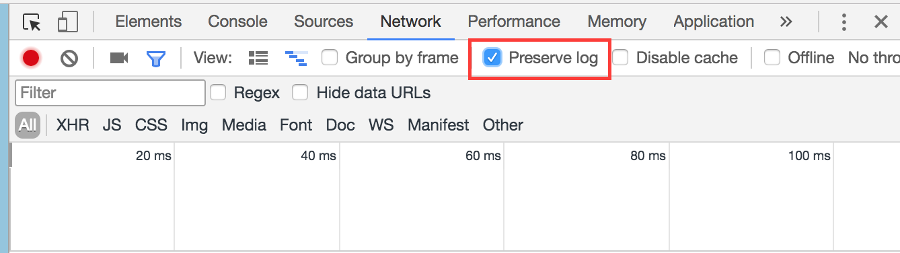
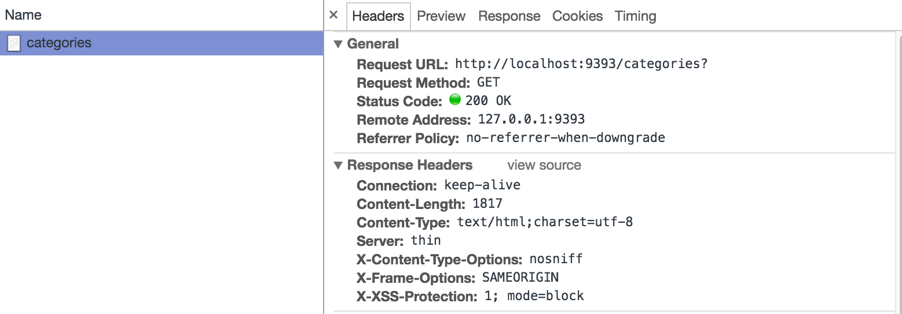

# Debugging Drill: Using the Chrome Debugger

## Summary
In this challenge, we will take a deeper look at debugging Javascript code with the Chrome debugger. As you have learned with Ruby, software developers rarely write code 100% perfectly the first time. Instead, with a combination of good tests and debugging skills, we can continually test and refactor our code until it does what we want. After this module, you should walk away with a clear set of strategies for testing various parts of your web application.

## Releases

### Pre-release:  Opening the developer tools
There are several ways to open the chrome developer tools. You can always refer back to https://developer.chrome.com/devtools for further help

- Right click anywhere in a window and select `inspect`
- Press `cmd+opt+i`(mac) or `ctrl+shift+i` (windows)
- Use the chrome menu on the top right and select Tools -> Developer Tools

### Release 1: The Network Tab
The network tab is invaluable for debugging issues between your web server and your browser. It shows you exactly the requests that you are making (including AJAX requests), as well as the responses that the web server is giving back. A common mistake is to mistake which controller is being called. Perhaps you are using a `GET` instead of a `PUT`, or the route isn't right. **The Network tab helps you figure out if the issue is on the browser side or on the server side.**

Let's see it in action. Open up one of the challenges you've finished this week, such as:
- [Anonymous Blog](../../../../blog-1-anonymous-blog-challenge)
- [Craig's List Jr.](../../../../craigslist-jr-challenge)
- [User Registration and Authentication](../../../../user-registration-and-authentication-challenge)

Run your server, go to the website and open up the network tab. Check the `preserve log` checkbox.

Then, click on a link and note the requests that come in. You can inspect the data coming in and out by clicking on a request on the left column, and then viewing the details (such as the headers in the request/response cycle)

#### Answer the following questions:
1. What route is being hit in the above picture?
1. What method is it?
1. What status did the server respond with?
1. What data type did the server respond with?

### Release 2: Setting Breakpoints
The Chrome team has put together a great tutorial on how to set breakpoints with the Chrome debugger. Follow the guide https://developers.google.com/web/tools/chrome-devtools/javascript/

#### Answer the following questions:

1. What tab in the developer tools do you use to debug javascript?
1. How do you set a breakpoint in some code that you wrote?
1. How do you set a breakpoint when the user does something (like click a button)
1. What are two ways of inspecting the state of a variable when you are broken in the debugger?
1. How do you toggle between enabling and disabling breakpoints?

### Release 3: Greet!
Open the challenge in chrome using the `open` command on the terminal `open release-3/index.html`

When you click the greet button, it is supposed to say hello, but it's not working. Debug the code and commit the fixed version.

### Release 4: Listing students
Open the challenge in chrome using the `open` command on the terminal `open release-4/index.html`

When you click the list students button, it is supposed to display a list of all of the students who have a favoriteColor of blue, but it's not working. Practice your debugging skills to fix what's wrong and commit the fixed version.
